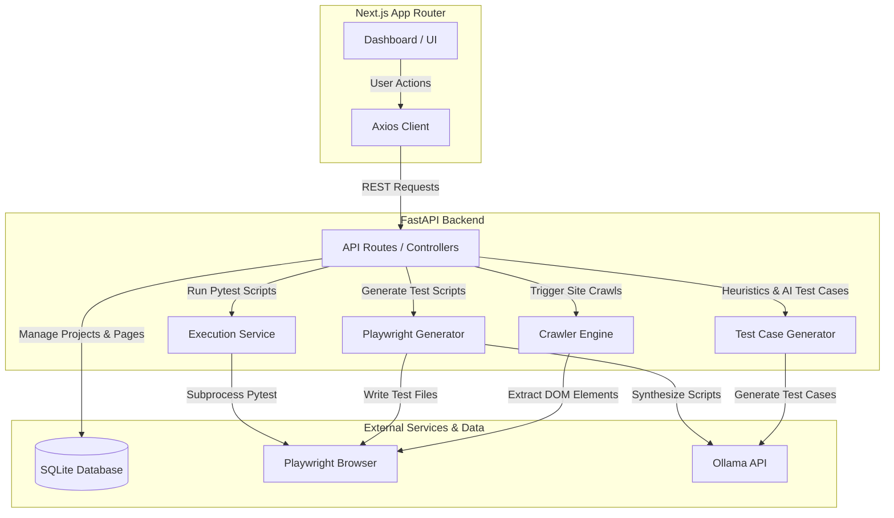

# AI-Powered QA Platform

An autonomous, end-to-end web QA automation platform. The application allows users to create web automation test suites by recursively crawling websites, capturing interactive DOM elements, generating rule-based or AI-guided test cases, synthesizing Playwright test scripts, and running pytest scripts in real-time.

---

## 🏗️ System Architecture

The project consists of a **FastAPI backend** (Python), a **Next.js frontend** (TypeScript & React), a **SQLite database**, and integrations with **Playwright** for web interaction and **Ollama** (`gpt-oss:120b`) for AI reasoning.



---

## 📁 Repository Directory Structure

Below is the file tree highlighting the roles of key files in the repository:

```text
qa-platform/
│
├── app/                              # FastAPI Backend Source
│   ├── api/                          # Placeholder for additional REST endpoints
│   │   └── projects.py               
│   │
│   ├── crawler/                      # Web Crawler Engine
│   │   ├── crawler.py                # Single-page scanner (manages browser context)
│   │   ├── page_scanner.py           # In-browser DOM element, link, & feature extraction
│   │   ├── site_crawler.py           # Multi-page recursive crawler (with safeguards & blocklists)
│   │   └── url_helper.py             # URL path resolving utility for routing indicators
│   │
│   ├── database/                     # Database Configuration & ORM Models
│   │   ├── db.py                     # SQLAlchemy SQLite engine & session configuration
│   │   ├── dependencies.py           # DB session injection dependency
│   │   └── models.py                 # SQLAlchemy models representing the Knowledge Graph (11 tables)
│   │
│   ├── generators/                   # Test Suite & Code Generation Logic
│   │   ├── playwright_generator.py   # Heuristic template-based Playwright script builder
│   │   └── testcase_generator.py     # Rule-based element test case generator (Positive, Negative, Boundary)
│   │
│   ├── routes/                       # FastAPI Route Controllers
│   │   ├── ai_routes.py              # AI test case generation triggers
│   │   ├── auth_routes.py            # Headless browser manual authentication endpoints
│   │   ├── crawl_routes.py           # Single-page and background recursive crawling
│   │   ├── execution_routes.py       # Pytest execution runner, logs history, and QA reports
│   │   ├── page_routes.py            # Detailed stats and element queries for crawled pages
│   │   ├── project_routes.py         # Project CRUD operations
│   │   ├── script_routes.py          # Python automation script generation triggers
│   │   └── testcase_routes.py        # Rule-based test case generation triggers
│   │
│   ├── services/                     # Business Logic Services
│   │   ├── ai_playwright_service.py  # Calls Ollama (gpt-oss:120b) to write Playwright test files
│   │   ├── ai_service.py             # Calls Ollama to produce logical test cases
│   │   └── execution_service.py      # Subprocess pytest runner & statistics parsing
│   │
│   └── main.py                       # FastAPI Application Entry Point
│
├── ai-qa-frontend/                   # Next.js React Frontend (App Router)
│   ├── app/                          # Next.js App Router Pages
│   │   ├── globals.css               # Tailwinds Global Styling
│   │   ├── layout.tsx                # Main Shell layout (integrates Sidebar)
│   │   ├── page.tsx                  # Landing page (Project creation/selection)
│   │   ├── page/[id]/page.tsx        # Page Detail View (DOM inspector, test cases, code editor, run logs)
│   │   └── projects/[id]/page.tsx    # Project Dashboard (Crawl config, page graph, authentication status)
│   │
│   ├── components/                   
│   │   └── Sidebar.tsx               # Navigation sidebar component
│   │
│   └── services/                     
│       └── api.ts                    # Preconfigured Axios instance targeting port 8000
│
├── data/                             # Persistent data folder
├── execution_reports/                # Stores stdout/stderr outputs of running pytest tests
├── generated_scripts/                # Stores generated Python Playwright scripts and session configs
├── test_pages/                       # Mock HTML mockups for local development testing
├── .env                              # Backend configuration file (includes Ollama API key)
├── requirements.txt                  # Python dependencies
└── qa_platform_v3.db                 # SQLite database file
```

---

## 🛠️ Installation & Setup

Follow these steps to run the application on Windows.

### 1. Prerequisites
- **Python 3.10+** installed.
- **Node.js 18+** installed.
- **Git** (for version control).
- access to the **Ollama** model service.

---

### 2. Backend Setup

1. **Create and activate a virtual environment:**
   ```powershell
   python -m venv venv
   .\venv\Scripts\Activate.ps1
   ```

2. **Install Python packages:**
   ```powershell
   pip install -r requirements.txt
   ```

3. **Install Playwright browser binaries:**
   ```powershell
   playwright install chromium
   ```

4. **Configure Environment Variables:**
   Create a `.env` file in the project root:
   ```env
   OLLAMA_API_KEY="your_api_key_here"
   ```

5. **Start the FastAPI server:**
   ```powershell
   uvicorn app.main:app --reload --port 8000
   ```
   The backend API will run on `http://localhost:8000`. You can access API documentation (Swagger UI) at [http://localhost:8000/docs](http://localhost:8000/docs).

---

### 3. Frontend Setup

1. **Navigate to the frontend folder:**
   ```powershell
   cd ai-qa-frontend
   ```

2. **Install Node modules:**
   ```powershell
   npm install
   ```

3. **Start the Next.js development server:**
   ```powershell
   npm run dev
   ```
   Open [http://localhost:3000](http://localhost:3000) in your browser to view the application interface.

---

## 🔄 Core Flows

### 🔑 1. Manual Session Capture (Authentication Flow)
To crawl behind login forms, the platform captures session states using Playwright's `storage_state`:
1. The user inputs a Login URL in the **Auth Settings** section of the Project page and clicks **Open Login Browser**.
2. **Backend Action** (`POST /auth/{project_id}/start-session`): Launches a visible, non-headless Chromium browser using Playwright on a persistent background thread.
3. The user interacts with the browser, performs the necessary login steps (entering credentials, completing OTPs), and returns to the UI.
4. The user clicks **Capture Session** in the UI.
5. **Backend Action** (`POST /auth/{project_id}/capture-session`): Signals the background browser thread to run `context.storage_state()`. This extracts all active cookies and `localStorage` values.
6. The state is serialized to JSON and stored in the `auth_configs` table. The browser is closed.
7. Future crawler requests and script executions read this JSON file, restoring the authenticated browser state.

---

### 🔍 2. Crawling & Scanning Flow
1. The user initiates a crawl for a project, specifying the target URL and maximum pages limit.
2. **Backend Action** (`POST /crawl/test-recursive/{project_id}`): Launches a recursive crawler in a background thread.
3. **Execution & Deduplication**:
   - The crawler checks if an `AuthConfig` is stored for the project. If yes, it loads the saved cookies and session state into the Playwright context.
   - It crawls URLs recursively, filtering out external domains, blocked extensions (e.g. PDFs, images), and logout paths to prevent accidental session termination.
   - For each page, a custom JavaScript payload runs in the browser context to parse interactive DOM elements (inputs, links, buttons) and evaluate selector paths (`xpath`, `css_selector`).
4. **Database Storage**:
   - Stores the page detail in the `pages` table.
   - Stores all interactive DOM nodes in the `elements` table.
   - Records page feature metrics (forms, tables, searches) in the `page_features` table.
5. **Progress Polling**: The frontend polls `GET /crawl/status/{crawl_run_id}` every 2 seconds to update the crawl progress bar and page count.
6. Once complete, `GET /crawl/projects/{project_id}/graph` constructs a visualization graph mapping parent-child page relationships.

---

### 🧪 3. Test Case & Script Generation Flow
1. **Rule-Based Generation**:
   - The user triggers test case creation for a page.
   - **Backend Action** (`POST /testcases/generate/{page_id}`): The system reviews the `elements` and `page_features` tables. 
   - Based on structural rules (e.g., if an input tag has `type="email"`, or an element is marked `required="true"`), it formats boundary and functional test scenarios.
2. **AI-Powered Generation**:
   - The user triggers AI Test Generation.
   - **Backend Action** (`POST /ai/generate/{page_id}`): The backend compiles a schema representing the page's elements and calls Ollama. The model writes new test cases, returning JSON containing test descriptions, categories, and priorities.
3. **Playwright Script Synthesis**:
   - The user clicks **Generate Automation Script** (Template or AI).
   - **Backend Action** (`POST /scripts/generate/{page_id}` or `POST /scripts/ai-generate/{page_id}`):
     - The Template Generator builds a structured Python test script asserting the visibility and functions of the page's elements.
     - The AI Script Generator feeds the DOM details and target test scenarios to the Ollama model, prompting it to write a standard, self-contained pytest file wrapped with error capture blocks.
     - The script is saved to the `/generated_scripts` directory on disk and indexed in the `automation_scripts` table.

---

### 🏃 4. Test Execution Flow
1. The user clicks **Run Test** on a page's script view.
2. **Backend Action** (`POST /execution/run/{page_id}`):
   - The execution service checks if `auth_state_{project_id}.json` exists. If so, it writes the state to a JSON config inside `/generated_scripts` so the test runs inside the active session.
   - It runs `pytest` in a Python subprocess:
     ```powershell
     pytest generated_scripts/page_{page_id}_v{version}.py -v --tb=short
     ```
   - If assertions fail, Playwright captures a screenshot and saves it.
3. **Log Parsing & Reporting**:
   - Standard output and error streams are captured in real-time.
   - The executor uses regex patterns to extract final execution statuses (PASS, FAIL, TIMEOUT) and counts (total tests, passed, failed).
   - The complete log output is saved as a text report under `/execution_reports` and saved to the `test_executions` DB table.
4. The UI displays the console log output, duration, and execution success indicator.

---

## 🗄️ Database Schema Details

The application uses SQLite as its metadata engine. Below is a summary of the database schema (`app/database/models.py`):

| Model | Table Name | Description | Key Attributes / Relationships |
|---|---|---|---|
| **Project** | `projects` | User-defined targets for testing. | `id`, `name`, `url`<br>↳ Relationships: `pages`, `crawl_runs`, `auth_config` |
| **CrawlRun** | `crawl_runs` | Logs history and progress metrics for a website crawl. | `id`, `status`, `pages_found`, `max_pages`<br>↳ Relates to: `Project` |
| **Page** | `pages` | Crawled URLs. Houses DOM snapshots. | `id`, `title`, `url`, `depth`, `html_content`<br>↳ Relates to: `Project`, `CrawlRun`, parent `Page` |
| **Element** | `elements` | Interactive DOM elements extracted during scanning. | `id`, `element_type`, `tag_name`, `locator`, `css_selector`, `xpath`, `visible`, `required`<br>↳ Relates to: `Page` |
| **PageFeature** | `page_features` | Counts of features (tables, search boxes, forms) parsed on a page. | `id`, `feature_type`, `feature_value`<br>↳ Relates to: `Page` |
| **PageLink** | `page_links` | Individual out-links found on a scanned page. | `id`, `to_url`<br>↳ Relates to: `Page` |
| **TestCase** | `test_cases` | High-level logical scenarios created for a page. | `id`, `title`, `category`, `priority`, `expected_result`, `source` (rule/ai)<br>↳ Relates to: `Page` |
| **AIRecommendation**| `ai_recommendations`| AI analysis suggestions written for a page. | `id`, `model`, `recommendation`<br>↳ Relates to: `Page` |
| **AutomationScript** | `automation_scripts` | Versioned Playwright Python scripts generated for a page. | `id`, `framework`, `script_name`, `script_content`, `version`, `script_path`<br>↳ Relates to: `Page` |
| **TestExecution** | `test_executions` | History of script runs with time logs and return codes. | `id`, `status`, `duration`, `error_message`, `execution_log`, `screenshot_path`<br>↳ Relates to: `Page`, `AutomationScript` |
| **AuthConfig** | `auth_configs` | Saved cookies/local-storage from manual browser login. | `id`, `status` (active/expired), `session_state`, `login_url`, `landing_url`<br>↳ Relates to: `Project` |
